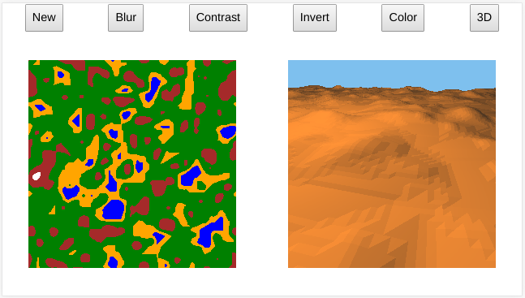

# Terrain Generator

A 3D terrain generator from height map using Three.js

## How to use

* New - generate e new height map
* Blur - smooth the height map
* Contrast - accentuates the height map
* Invert - invert the height map
* Color - display the height map in colors. Black means water level and white means mountains
* 3D - generates the 3D map or update it based on the height map
